# FlyShelf PC — Complete Professional Finish Audit

> **Date:** July 14, 2026  
> **Method:** 8 parallel AI auditors analyzing 167 C# files + all XAML across the entire codebase  
> **Total findings:** 150+ issues across 10 audit domains  
> **Purpose:** Hand this to Fable AI to fix everything in one session

---

## Quick Navigation

| Section | Domain | Critical | High | Medium | Low |
|---------|--------|----------|------|--------|-----|
| [§1](#1-crash-prevention--stability) | Crash Prevention & Stability | 4 | 9 | 13 | 5 |
| [§2](#2-clipboard-scroll--text-rendering) | Clipboard Scroll & Text | 3 | 4 | 5 | 3 |
| [§3](#3-visual-design-system) | Visual Design System | 0 | 2 | 6 | 3 |
| [§4](#4-hub-window-polish) | Hub Window Polish | 0 | 2 | 5 | 3 |
| [§5](#5-accessibility--input) | Accessibility & Input | 0 | 5 | 6 | 4 |
| [§6](#6-startup--window-management) | Startup & Window Management | 0 | 1 | 4 | 2 |
| [§7](#7-reliability--data-integrity) | Reliability & Data Integrity | 0 | 0 | 0 | 6 |
| [§8](#8-animation--micro-interactions) | Animation & Micro-interactions | 0 | 1 | 4 | 2 |
| [§9](#9-search--paste--hide-flow-ui-freeze) | Search → Paste → Hide Flow | 0 | 3 | 3 | 0 |

---

## 1. Crash Prevention & Stability

> [!CAUTION]
> These issues can crash the app or cause deadlocks. Fix first.

### 🔴 CRITICAL

| # | File | Line | Issue | Fix |
|---|------|------|-------|-----|
| C-1 | [WebView2Converter.cs](Classes/WebView2Converter.cs#L23) | 23 | `Dispatcher.Invoke(async =>` anti-pattern — returns `Task<Task<bool>>`, completes on first `await` yield | Replace with `await Dispatcher.InvokeAsync(...)` |
| C-2 | ~30 networking files | — | ~50 `Application.Current.Dispatcher` calls without null guard — crashes during shutdown | Replace all with `Application.Current?.Dispatcher?.InvokeAsync(...)` |
| C-3 | [PdfMergeWindow.xaml.cs](Windows/PdfMergeWindow.xaml.cs#L488) | 488,717,729,739,750 | Sync `Dispatcher.Invoke` + `MessageBox.Show` inside `Task.Run` — deadlock | Replace with `Dispatcher.InvokeAsync` |
| C-4 | [MainWindow.xaml.cs](MainWindow.xaml.cs#L1808) | 1808 | `task.Wait(60)` blocking UI thread for virtual desktop COM call | Make async or use `InvokeAsync` |

### 🟠 HIGH — Thread Safety

| # | File | Line | Issue | Fix |
|---|------|------|-------|-----|
| H-1 | [CloudflareDaemon.cs](Classes/Network/CloudflareDaemon.cs#L18) | 18 | `_stopped` not `volatile` — background threads read stale value | Add `volatile` |
| H-2 | [NetworkSyncServer.cs](Classes/Network/NetworkSyncServer.cs#L25) | 25 | `_isRunning` not `volatile` | Add `volatile` |
| H-3 | [HubWindow.Settings.cs](Windows/HubWindow.Settings.cs#L230) | 230,240,517 | `Dispatcher.Invoke` inside `Task.Run` — deadlock risk | Use `InvokeAsync` |
| H-4 | [NetworkLogsWindow.xaml.cs](Windows/NetworkLogsWindow.xaml.cs#L125) | 125,206 | `Dispatcher.Invoke` per log entry blocks background | Batch + `InvokeAsync` |

### 🟠 HIGH — Null Safety

| # | File | Lines | Issue |
|---|------|-------|-------|
| H-5 | QuickLookWindow.xaml.cs | 991,2530,2608 | Direct `Application.Current.MainWindow as MainWindow` without `?.` |
| H-6 | ReminderAlertWindow.xaml.cs | 75 | Same pattern |
| H-7 | HubWindow.Settings.cs | 772,805 | Same pattern |
| H-8 | HubWindow.Interactions.cs | 259 | Same pattern |
| H-9 | Positioning.cs | 474-485 | No defensive uncloak on exception — window permanently cloaked |

### 🟡 MEDIUM — Thread + UI Performance

| # | File | Issue |
|---|------|-------|
| M-1 | NetworkSyncServer.cs:30,226 | `_proxyRunning`/`_tlsRunning` not `volatile` |
| M-2 | NetworkClock.cs:19-20,25 | Static bools `_synced`/`_driftDetected`/`_anchorLoaded` not `volatile` |
| M-3 | PeerManager.cs:34-35 | `_urlCleanedFromFirebase`/`_urlRequestSent` not `volatile` |
| M-4 | EmojiPickerWindow.xaml.cs:252 | `Dispatcher.Invoke` in `ContinueWith` |
| M-5 | HubWindow.xaml.cs:106,111,118,371 | `Dispatcher.Invoke` in event handlers |
| M-6 | DropHandler.cs:744 | `File.ReadAllText` on UI thread during .MD paste |
| M-7 | MainWindow.Notes.cs (7 locations) | Multiple `UpdateLayout()` calls — stutter |
| M-8 | MainWindow.Todo.cs:418,425 | Double `UpdateLayout()` passes on subtask focus |
| M-9 | Lifecycle.cs:733-770 | `AnimateAndHide` sets Opacity=0 but defers SW_HIDE — race window |
| M-10 | Multiple files (7) | `Application.Current.Resources`/`.Windows` without `?.` |
| M-11 | BulkObservableCollection | `_suppressNotification` is `volatile` ✅ but AddRange/RemoveRange not atomic across lock |
| M-12 | WndProc.cs:577,641 | No text size limit at clipboard capture — 100MB text fully loaded before spill |
| M-13 | FlyShelfViewModel.DropHandler.cs:997 | `File.ReadAllBytes` for thumbnails up to 100MB — streaming would be safer |

---

## 2. Clipboard Scroll & Text Rendering

> [!IMPORTANT]
> **Clarification from the user:** Hub scrolling is PERFECT — do NOT change `SmoothScrollPCApp.cs`. ALL scroll issues are in the clipboard only (`SmoothScroll.cs`).

### 🔴 Bold Text — Root Cause

**Two factors compound to make ALL text look excessively bold:**

#### Factor 1: `TextFormattingMode="Ideal"` (window-level)

| Location | Line | Setting |
|----------|------|---------|
| [MainWindow.xaml](MainWindow.xaml#L18) | 18 | `TextOptions.TextFormattingMode="Ideal"` (WINDOW ROOT) |
| [MainWindow.xaml](MainWindow.xaml#L1009) | 1009 | `TextOptions.TextFormattingMode="Ideal"` (ListView — redundant) |
| [MainWindow.xaml](MainWindow.xaml#L1062) | 1062 | `TextOptions.TextFormattingMode="Ideal"` (CardBorder — redundant) |

`Ideal` = WPF renders wider/bolder glyphs that don't match native Windows text.  
`Display` = Pixel-snapped, lighter, matches Explorer/VS Code/every other Windows app.

**Fix:** Change line 18 to `TextFormattingMode="Display"`. Remove lines 1009 and 1062 (inherited).

#### Factor 2: `FontWeight="SemiBold"` on Title Text

[MainWindow.xaml:2094](MainWindow.xaml#L2094):
```xml
<TextBlock Name="TitleText" FontWeight="SemiBold" FontSize="13" .../>
```

**Fix:** Change to `FontWeight="Normal"` or `FontWeight="Medium"`.

### 🔴 Clipboard Scroll Engine Bugs

| # | Issue | Current | Fix | Impact |
|---|-------|---------|-----|--------|
| S-1 | Dead constants don't match code | `MinVelocity=0.15`, `DirectionBrakeMul=0.30` declared but never used — code uses hardcoded `0.15` and `0.55` | Use the constants or delete them | Maintainability |
| S-2 | Per-frame `.ToList()` allocation | [SmoothScroll.cs:265](Classes/Scrolling/SmoothScroll.cs#L265) `_states.Keys.ToList()` every frame | Pre-allocate `List` buffers like Hub engine | GC pressure at 60fps |
| S-3 | Double `DisableStaticCanvas` call | Called inline at stop + again in cleanup loop | Remove one | Minor waste |

### 🟡 Clipboard Scroll Tuning

| # | Issue | Detail |
|---|-------|--------|
| S-4 | Upward scroll one-frame glitch | WPF VirtualizingPanel layout shift visible for 1 frame before absorption. **Fundamental WPF limitation.** Mitigation: increase `VirtualizingPanel.CacheLength` to `"2,2"` (currently `"1,1"`) |
| S-5 | 250px bottom padding | [MainWindow.xaml:1006](MainWindow.xaml#L1006) — `Padding="0,0,0,250"` creates huge dead scroll zone. Reduce to 60-100px |

### 🟡 100+ DataTriggers Per Card (Scroll Lag Root Cause)

Every clipboard card has **100+ DataTrigger evaluations** during virtualization recycling:

| Element | Triggers | Consolidation |
|---------|----------|---------------|
| SemanticIconBorder | 11 MultiDataTriggers | → 1 ViewModel `ShowSemanticIcon` property |
| Semantic SymbolIcon | 12 DataTriggers | → 1 ViewModel `SemanticIconSymbol` + `SemanticIconBrush` |
| Smart Action icon | 8 DataTriggers | → 1 ViewModel `SmartActionSymbol` |
| Open File pill | 8 DataTriggers | → 1 ViewModel `ShowOpenFile` bool |
| Show in Explorer pill | 8 DataTriggers | → 1 ViewModel `ShowExplorer` bool |
| PDF Merge Toggle | 8 MultiDataTriggers | → 1 ViewModel `ShowMergeToggle` bool |
| Source app label | 6 DataTriggers | → 1 ViewModel `ShowSourceApp` bool |

**Total: ~100+ triggers → ~10 ViewModel properties** = massive recycle performance improvement.

### 🟢 Collapsed Elements Created for Every Card

Audio player, PDF merge toggle, Rotate button, MarkdownPreview — all created in the visual tree for every card even when not applicable (~80% wasted). Ideal fix: `DataTemplateSelector` per item type. Pragmatic fix: the above ViewModel consolidation reduces trigger overhead enough.

---

## 3. Visual Design System

### 🟠 HIGH — Hardcoded Colors (345+ instances)

| File | Count | Examples |
|------|-------|---------|
| AiSettingsControl.xaml | ~30 | `#222240`, `#1A1A35`, `#CDD6F4` |
| NetworkingPanelControl.xaml | ~50 | `#F59E0B`, `#FCD34D`, `#818CF8` |
| NotesPanelControl.xaml | ~60 | `#16162A`, `#8B5CF6`, `#25FFFFFF` |
| TodoPanelControl.xaml | ~30 | Various |
| OnboardingWindow.xaml | ~30 | Dark-only hardcoded |
| MainWindow.xaml | ~20 | Semi-transparent overlays, semantic icon default `#60A5FA` |

**Fix:** Move to `DynamicResource` from `FlyShelfColorPalette.xaml` (which already has ~100 named tokens).

### 🟠 HIGH — Corner Radius Inconsistency (14+ distinct values)

| Radius | Usage |
|--------|-------|
| 4, 6, 7, 8, 10, 12, 14, 16, 20, 24 | Cards, buttons, inputs, modals |

**Fix:** Standardize to 5 values: `4` (small/tags), `8` (buttons/inputs), `12` (cards), `16` (panels), `24` (pills/modals).

### 🟡 MEDIUM — No Formal Type Ramp

Font sizes found: 8, 9, 10, 10.5, 11, 11.5, 12, 12.5, 13, 14, 15, 16, 18, 24, 28, 32  
**No resource dictionary defines these.** All inline.

**Fix:** Define a type ramp in the resource dictionary:
```xml
<sys:Double x:Key="TypeCaption">10</sys:Double>
<sys:Double x:Key="TypeBody">12</sys:Double>
<sys:Double x:Key="TypeSubtitle">14</sys:Double>
<sys:Double x:Key="TypeTitle">18</sys:Double>
<sys:Double x:Key="TypeHeadline">24</sys:Double>
```

### 🟡 MEDIUM — `StaticResource` Colors in Clipboard Card

Semantic icons, sender badges, transfer methods, audio player, code text — all use `StaticResource` which won't update on live theme switch. Change to `DynamicResource`.

### 🟡 MEDIUM — No Spacing Scale Resource

Margins/paddings are inline. Non-standard values (3, 5, 7, 9, 15) mixed with standard 4px grid.

### 🟡 MEDIUM — No Loading Skeleton Screens

Only basic `ProgressBar IsIndeterminate` exists. No shimmer placeholders for clipboard items, images, or thumbnails.

---

## 4. Hub Window Polish

> **Note:** Hub SCROLLING is perfect. These are UI/UX issues only.

### 🟠 HIGH — Non-Virtualized `ItemsControl` Lists

| Control | Content | Risk |
|---------|---------|------|
| `HistoryItemsControl` | Transfer history | **HIGH** — grows to hundreds |
| Live Event Feed | Events | **MEDIUM** — grows over time |
| PeerStatusPanel | Paired devices | Low |
| NearbyDevicesPanel | Nearby devices | Low |

**Fix:** Replace `HistoryItemsControl` with `ListView` + `VirtualizingStackPanel.IsVirtualizing="True"`.

### 🟠 HIGH — Zero Tab Switch Animations

Tab navigation uses instant `Visibility.Collapsed` → `Visible` toggles in code-behind. No fade, no slide.

**Fix:** Add `OpacityAnimation` (200-300ms, CubicEase) on tab content grids.

### 🟡 MEDIUM

| # | Issue | Fix |
|---|-------|-----|
| 1 | 15 `MessageBox.Show` instances | Replace with `ToastWindow.ShowToast()` for info, custom overlay for confirmations |
| 2 | Font size inconsistency: section headers use 16, 18, 20, 28 | Standardize to type ramp |
| 3 | Dashboard cards — `Cursor="Hand"` but no hover visual feedback | Add hover background/border glow |
| 4 | `Height="54"` hardcoded on description text (lines 420, 472) | Use `MaxHeight` or remove — clips at different DPI/font scales |
| 5 | "Hub" brand text double-dimmed (TextFillColorSecondary + Opacity=0.7 = ~46% opacity) | Use one or the other |

### 🟢 LOW

| # | Issue |
|---|-------|
| 1 | About page version badge hardcoded to "v2.0.0 Stable" — will show stale |
| 2 | `DropShadowEffect` on MergePdfFloatingBar triggers software rendering |
| 3 | Missing empty states for Network sub-tabs (File Queue, Nearby, Devices) |

---

## 5. Accessibility & Input

### 🟠 HIGH

| # | Issue | File | Fix |
|---|-------|------|-----|
| A-1 | **Header toolbar buttons unfocusable** — `PremiumHeaderButtonStyle` sets `Focusable="False"` on ALL header buttons | [MainWindow.xaml:42](MainWindow.xaml#L42) | Remove `Focusable="False"` from style |
| A-2 | **All 16 action pill buttons are mouse-only** — `Focusable="False"` + `PreviewMouseLeftButtonDown` only | MainWindow.xaml:1274-1579 | Make Pin/Delete/Open focusable, add keyboard handlers |
| A-3 | **No High Contrast mode detection** — zero refs to `SystemParameters.HighContrast` or `SystemColors` | Entire codebase | Add High Contrast resource dictionary swap |
| A-4 | **345+ hardcoded hex colors** won't adapt to High Contrast or theme changes | AI/Network/Notes/Todo panels | Move to DynamicResource |
| A-5 | **FocusVisualStyle suppressed globally** — `FocusVisualStyle="{x:Null}"` on all interactive elements | MainWindow + GlassTheme | Provide a custom focus border style |

### 🟡 MEDIUM

| # | Issue | Fix |
|---|-------|-----|
| A-6 | 12 windows have zero `AutomationProperties.Name` (Onboarding, NoteExpand, ReminderAlert, etc.) | Add names to interactive elements |
| A-7 | No RTL (right-to-left) support — zero `FlowDirection` properties; hardcoded LTR in text measurement | Add `FlowDirection` binding to system culture |
| A-8 | App doesn't respect Windows "Make text bigger" setting — all 400+ font sizes hardcoded | Use relative font sizing or multiplier |
| A-9 | 6 windows have no Escape handler (EmojiPicker, Password, ReminderCreate, Onboarding, NetworkLogs, PdfMerge) | Add `KeyDown` Escape handlers |
| A-10 | Context menu items (20+ in CardContextMenu) have no `AutomationProperties.Name` | Headers suffice for basic screen readers, but explicit names are better |
| A-11 | No touch gestures — zero `ManipulationDelta`/`TouchDown` handlers | Low priority but swipe-to-delete would be premium |

### Complete Keyboard Shortcuts Reference

#### Global (RegisterHotKey)
| Shortcut | Action | Customizable? |
|----------|--------|---------------|
| **Alt+C** (default) | Toggle clipboard | ✅ Yes (Settings) |
| **Alt+1 to Alt+9** | Quick-paste item 1-9 | ✅ Toggleable |
| **Alt+0** | Quick-paste item 10 | ✅ Toggleable |

#### Clipboard
| Shortcut | Action |
|----------|--------|
| **Ctrl+F** | Open/focus search |
| **Ctrl+V** | Drop clipboard into shelf |
| **Enter** | Paste selected item + hide |
| **Delete** | Delete selected items |
| **Escape** | Close search → hide window |
| **↑ / ↓** | Navigate items |

#### Notes
| Shortcut | Action |
|----------|--------|
| **Ctrl+S** | Save | **Ctrl+B/I** | Bold/Italic |
| **Ctrl+D** | Dark mode | **Ctrl+T** | Toolbar |
| **Ctrl+L** | Line numbers | **Ctrl+K** | Hyperlink |
| **Ctrl+±** | Font size | **Ctrl+Shift+C** | Copy as code block |

#### Todo
| Shortcut | Action |
|----------|--------|
| **Enter** | Confirm item | **Ctrl+D** | Delete focused |
| **Ctrl+Shift+↑/↓** | Move item up/down |

---

## 6. Startup & Window Management

### 🟠 HIGH

| # | Issue | File | Fix |
|---|-------|------|-----|
| W-1 | **No `OnDpiChanged` override** — PerMonitorV2 declared but no handler for monitor DPI changes | MainWindow | Add override to recalculate `_lockedBottomEdge` and re-clamp position |

### 🟡 MEDIUM

| # | Issue | File | Fix |
|---|-------|------|-----|
| W-2 | `RuntimeHost.Initialize()` blocking file I/O (ZIP extraction) on startup | [RuntimeHost.cs:13-34](Classes/Startup/RuntimeHost.cs#L13) | Move to `Task.Run()` |
| W-3 | 4 sequential sync file reads during startup (Settings, License, Reminder, IntegrityCheck) | App.xaml.cs:435-453 | Parallelize with `Task.WhenAll()` |
| W-4 | `.Wait(1500)` blocking exit | App.xaml.cs:809 | Fire-and-forget on exit |
| W-5 | Multiple `new WindowInteropHelper(this)` allocations during spawn | MainWindow.Positioning.cs | Cache HWND at method top |

### ✅ What's Excellent

| Area | Why |
|------|-----|
| Single instance | 3-tier mutex: own variant + rival variant + legacy |
| Auto-start | Dual-mode (MSIX + registry) with cross-variant conflict guard |
| Window creation | `Dispatcher.InvokeAsync(Background)` + offscreen positioning |
| Hub created on-demand | Saves ~15-30MB idle RAM |
| Shutdown | 11-step cleanup, data flush, peer notification |

---

## 7. Reliability & Data Integrity

> [!TIP]
> This is the **strongest area** of the codebase. Almost everything is production-quality.

### ✅ Excellent Systems

| System | Implementation |
|--------|---------------|
| **Data persistence** | Atomic write-to-temp-then-rename, `.bak` backup, auto-recovery from corruption, disk space check, stale snapshot guard |
| **Update mechanism** | SHA-256 verification, 50MB minimum size check, `.bak` rollback, health check + auto-restore on post-update crash |
| **Clipboard monitoring** | Debounce + token dedup, echo suppression, 3× retry with 5ms delay on COM failure, background processing off WndProc |
| **Logging** | Async buffered, 5MB rotation × 3 files, 500-line truncation every 5min, PII redaction, dual network log |
| **Network** | Multi-layer fallback (LAN → Cloudflare), centralized HttpClient pool (4 purpose-specific), handshake/heartbeat timeouts |
| **Large data** | Text >10M chars spills to disk, 2500 item cap, 300px thumbnail decode, approaching-limit toasts |
| **Security** | Encrypted password storage, passwords blocked from sync, incognito mode |
| **Safe mode** | Full crash recovery UI, auto-restart, user-friendly error display |

### 🟡 Minor Improvements

| # | Issue | Fix |
|---|-------|-----|
| 1 | `AddClipboardFormatListener` return value not checked | Log warning if false |
| 2 | No `RemoveClipboardFormatListener` on close | Add explicit cleanup |
| 3 | No fallback placeholder icon for failed thumbnails | Show broken-image glyph |
| 4 | No dedicated "empty clipboard" message | "Copy something to get started!" |
| 5 | No "no network" empty state in clipboard UI | Show indicator |
| 6 | Release builds have logging disabled entirely | Add errors-only mode |

---

## 8. Animation & Micro-interactions

### Current State

| Window | Animation Quality | Score |
|--------|------------------|-------|
| MainWindow (clipboard) | Excellent — card hover lift, glow, action pill reveal, drag bounce | ⭐⭐⭐⭐⭐ |
| ToastWindow | Excellent — combined fade+slide+scale entrance/exit, accent glow | ⭐⭐⭐⭐⭐ |
| HubWindow | **Poor** — zero tab transitions, only card hover from shared style | ⭐⭐ |
| OnboardingWindow | Basic — fade-in only, no slide/scale, instant step dots | ⭐⭐⭐ |
| QuickLookWindow | Almost none — linear helper text fade, no window entrance | ⭐⭐ |

### Motion System (Exists — Well-Designed)

`MotionSystem.xaml` + `AnimationHelper.cs` define:
- `Motion.Instant`: 80ms (press feedback)
- `Motion.Fast`: 120ms (hover states)
- `Motion.Normal`: 180ms (standard transitions)
- `Motion.Entrance`: 220ms (fade+scale)
- `Motion.Slow`: 300ms (large surfaces)
- Easing: CubicEase EaseOut/In/InOut, BackEase Spring (0.4 amplitude)
- `PopIn()`, `PopOut()`, `PressPulse()`, `FadeTo()`, staggered list entrance

### 🟠 HIGH — Missing Animations

| Location | Missing Animation | Effort |
|----------|-------------------|--------|
| HubWindow tab switch | Fade/slide transition between Dashboard/Settings/About etc. | 2 hrs |

### 🟡 MEDIUM

| Location | Missing Animation | Effort |
|----------|-------------------|--------|
| OnboardingWindow steps | Slide + crossfade between steps, animated dot expansion | 1 hr |
| QuickLookWindow | Scale+fade pop-in on window open | 30 min |
| HubWindow empty states | Fade-in with delay | 15 min |
| Search box focus | Smooth border transition | 15 min |

---

## Master Priority Matrix

### Phase 1 — Crash Prevention (CRITICAL)
| # | Fix | Effort |
|---|-----|--------|
| C-1 | Fix `Dispatcher.Invoke(async =>` in WebView2Converter | 5 min |
| C-2 | Add `?.` to ~50 `Application.Current` calls in networking | 30 min |
| C-3 | Replace sync Invoke+MessageBox in PdfMergeWindow Task.Run | 15 min |
| C-4 | Make `IsWindowOnCurrentVirtualDesktop` async | 10 min |
| H-1/H-2 | Add `volatile` to `_stopped`, `_isRunning` | 5 min |

### Phase 2 — Visual Quality (HIGH)
| # | Fix | Effort |
|---|-----|--------|
| **Bold text** | Change `TextFormattingMode="Display"` + `FontWeight="Normal"` | 2 min |
| **Action pills keyboard** | Remove `Focusable="False"` from button styles | 10 min |
| **Hub HistoryItemsControl** | Convert to virtualized ListView | 30 min |
| **Hardcoded colors** | Move 345+ hex values to DynamicResource | 2-4 hrs |
| **Hub tab animations** | Add fade transition to tab navigation | 1-2 hrs |

### Phase 3 — Polish (MEDIUM)
| # | Fix | Effort |
|---|-----|--------|
| Scroll: Consolidate 100+ triggers to ViewModel | ~10 computed properties | 2-4 hrs |
| Scroll: Pre-allocate `.ToList()` buffers | 2 static `List<>` fields | 5 min |
| Scroll: Increase CacheLength to 2,2 | 1 XAML attribute | 1 min |
| Corner radius standardization | Replace 14 values with 5 | 30 min |
| Type ramp resource dictionary | Define 5 named sizes | 15 min |
| Replace 15 MessageBox.Show | Use ToastWindow | 1-2 hrs |
| Add DPI change handler | `OnDpiChanged` override | 15 min |
| Add focus visual style | Custom border instead of `{x:Null}` | 15 min |
| Fix font size inconsistency in Hub | Standardize section headers | 20 min |
| Add Escape handlers to 6 windows | Simple `KeyDown` handler | 15 min |

### Phase 4 — Nice to Have (LOW)
| # | Fix | Effort |
|---|-----|--------|
| Parallelize startup file reads | `Task.WhenAll()` | 15 min |
| Add empty states to Network tabs | Simple text + icon | 30 min |
| Onboarding step transitions | Slide + crossfade | 1 hr |
| QuickLookWindow entrance animation | Scale + fade | 30 min |
| Loading skeleton screens | Shimmer placeholders | 2-4 hrs |
| Add fallback placeholder icon for failed thumbnails | Broken-image glyph | 15 min |
| High Contrast mode support | SystemColors dictionary | 2-4 hrs |
| RTL support | FlowDirection binding | 2-4 hrs |
| Font scaling (Windows accessibility) | Relative sizing | 4-8 hrs |

## 9. Search → Paste → Hide Flow (UI Freeze)

> [!CAUTION]
> This traces the EXACT flow that freezes the UI when a user searches, clicks a result, and the clipboard dismisses. Total estimated UI thread freeze: **100-445ms**.

### The Complete Flow (Step by Step)

```mermaid
flowchart TD
    A["User types in search box"] --> B["150ms debounce timer fires"]
    B --> C["ApplySearchFilter — UI Thread"]
    C --> D["FuzzyMatcher.IsMatchAny × N items"]
    C --> E["SearchResultComparer sort — N×log(N) scores"]
    C --> F["RenderVisibleThumbnails()"]
    G["User clicks search result"] --> H["CopyItemAndPaste()"]
    H --> I["Clipboard.SetDataObject — UI Thread"]
    H --> J["AnimateAndHide()"]
    J --> K["CloseSearch() — 3 CollectionView refreshes"]
    J --> L["Scroll reset + SelectedIndex = 0"]
    J --> M["OptimizeMemoryUsage() × 2"]
    
    style D fill:#ff6b6b,color:#fff
    style E fill:#ff6b6b,color:#fff
    style I fill:#ffa94d,color:#fff
    style K fill:#ff6b6b,color:#fff
```



### 🔴 Lag Source 1: FuzzyMatcher Allocates Heavily Per Item (UI Thread)

**File:** [FuzzyMatcher.cs](Classes/Window/FuzzyMatcher.cs)  
**Called from:** [MainWindow.Search.cs:347-373](MainWindow.Search.cs#L347) (filter delegate)

For **each item** in the collection, `IsMatch()` does:
1. `text.ToLowerInvariant()` — **allocates new string**
2. `SplitWords(query)` — `input.ToLowerInvariant().Split()` — **allocates string array**
3. `SplitWords(text)` — same
4. `GetTrigrams()` — `new HashSet<string>` + `padded.Substring(i, 3)` for each trigram — **heavy GC pressure**

For 200 items with FuzzyMatcher running **twice** per item (RawContent + FileName): ~400 calls × string allocations = **20-100ms**.

**Fix:** Cache lowercased content in `ClipboardItem` (compute once on creation). Pre-compute trigrams. Move filter to `Task.Run` with `DeferRefresh()`.

### 🔴 Lag Source 2: SearchResultComparer Runs Full Scoring During Sort (UI Thread)

**File:** [SearchResultComparer.cs](Classes/Window/SearchResultComparer.cs)  
**Called from:** [MainWindow.Search.cs:376](MainWindow.Search.cs#L376)

`view.CustomSort = new SearchResultComparer(q)` triggers WPF's O(N log N) sort. Each comparison calls `FuzzyMatcher.ScoreBest()` **twice** (one per item). For 200 items: ~200×log(200)×2 ≈ **3000 full fuzzy score computations on UI thread**.

**Estimated lag:** 30-150ms.

**Fix:** Pre-compute scores for all items in one pass, store in dictionary, then sort by lookup. Or move entire filter+sort to background thread.

### 🔴 Lag Source 3: CloseSearch Does 3 CollectionView Refreshes During Hide

**File:** [MainWindow.Search.cs:287-308](MainWindow.Search.cs#L287)  
**Called from:** [MainWindow.Lifecycle.cs:729](MainWindow.Lifecycle.cs#L729) (AnimateAndHide)

When the clipboard hides, `CloseSearch()` does:
1. `view.Filter = null` → **full CollectionView refresh** (~10-30ms)
2. `ShelfListView.Items.Filter = null` + `AltShelfListView.Items.Filter = null`
3. `view.CustomSort = null` → **another full refresh** (~10-30ms)

That's **2-3 full collection refresh passes** during the time-critical hide animation.

**Fix:** Use `view.DeferRefresh()` to batch the filter+sort clear into one refresh. Or skip the refresh entirely since the window is about to be hidden — defer to next show.

### 🟠 Lag Source 4: Clipboard.SetDataObject Blocks UI Thread

**File:** [ClipboardHelper.cs:28-46](Classes/Clipboard/ClipboardHelper.cs#L28)

`Clipboard.SetDataObject()` and `Clipboard.SetText()` are synchronous Win32 calls. If another app holds the clipboard lock:
- **3 retries × 5ms `Thread.Sleep`** = 15ms UI freeze
- Plus the clipboard call itself: 5-50ms

**Fix:** Move clipboard write to `Task.Run` + `Dispatcher.InvokeAsync` for the actual SetDataObject call (must be on STA thread, but could use a dedicated STA thread pool).

### 🟡 Lag Source 5: OptimizeMemoryUsage Called Twice

**File:** [MainWindow.Lifecycle.cs:800](MainWindow.Lifecycle.cs#L800) + [MainWindow.xaml.cs:1680](MainWindow.xaml.cs#L1680)

Called once in `AnimateAndHide()` and again in deferred `HideWindowInternal()`. Each call iterates all `DroppedItems` to null out icons on non-pinned items.

**Fix:** Add a guard `_hasOptimizedThisHide` to prevent the second call.

### 🟡 Lag Source 6: CollectionChanged Handler Fires ReapplyActiveFilters Multiple Times

**File:** [MainWindow.xaml.cs:455-509](MainWindow.xaml.cs#L455)

Each `DroppedItems.Remove()` call triggers `CollectionChanged`, which can call `ReapplyActiveFilters()` synchronously. During bulk delete or filter-clear, this compounds:
- 1 remove = 1 CollectionChanged = 1 ReapplyActiveFilters
- 5 removes = 5 CollectionChanged = potentially 5 ReapplyActiveFilters

**Fix:** Use `BulkObservableCollection.SuppressNotification` for batch operations. Debounce `ReapplyActiveFilters` with a flag or short timer.

### 🟡 Lag Source 7: AltSearch Has No Debounce

**File:** `MainWindow.AltUI.cs:84-107`

The alternate UI search box fires `ApplySearchFilter()` **synchronously on every keystroke** — no debounce timer unlike the main search box's 150ms debounce.

**Fix:** Add the same 150ms debounce pattern from `MainWindow.Search.cs`.

### Timeline: What Happens on a Single Click→Paste

| Time (ms) | Operation | Thread | Blocking? |
|-----------|-----------|--------|-----------|
| 0 | `PreviewMouseLeftButtonUp` → guard checks | UI | 1ms |
| 1 | `CopyItemAndPaste()` → create DataObject | UI | 2ms |
| 3 | `ClipboardHelper.SafeSetDataObject()` | UI | **5-50ms** ⚠️ |
| 53 | `AnimateAndHide()` → opacity=0 | UI | 1ms |
| 54 | `CloseSearch()` → clear filter | UI | **10-30ms** ⚠️ |
| 84 | `CloseSearch()` → clear sort | UI | **10-30ms** ⚠️ |
| 114 | `CloseSearch()` → RenderVisibleThumbnails | UI | **5-20ms** ⚠️ |
| 134 | Scroll reset, SelectedIndex=0 | UI | **5-15ms** ⚠️ |
| 149 | `OptimizeMemoryUsage()` (1st) | UI+BG | **5-15ms** ⚠️ |
| 164 | Deferred `HideWindowInternal()` → SW_HIDE | UI | 1ms |
| 165 | `OptimizeMemoryUsage()` (2nd) | UI+BG | **5-15ms** ⚠️ |
| **Total** | | | **45-175ms** (freeze) |

With search filter + sort happening before the click: add another **50-250ms** for the initial filter pass.

---

## Master Priority Matrix

> [!IMPORTANT]
> **For Fable AI:** Start with Phase 1 (crash prevention), then Phase 1.5 (search→paste freeze — this is the user's #1 complaint). Then Phase 2 (visual quality). Phase 3 is the largest impact for perceived quality. Phase 4 is polish for enterprise/accessibility.

### Phase 1 — Crash Prevention (CRITICAL)
| # | Fix | Effort |
|---|-----|--------|
| C-1 | Fix `Dispatcher.Invoke(async =>` in WebView2Converter | 5 min |
| C-2 | Add `?.` to ~50 `Application.Current` calls in networking | 30 min |
| C-3 | Replace sync Invoke+MessageBox in PdfMergeWindow Task.Run | 15 min |
| C-4 | Make `IsWindowOnCurrentVirtualDesktop` async | 10 min |
| H-1/H-2 | Add `volatile` to `_stopped`, `_isRunning` | 5 min |

### Phase 1.5 — Search→Paste Freeze Fix (USER'S #1 COMPLAINT)
| # | Fix | Effort |
|---|-----|--------|
| **F-1** | **CloseSearch: batch filter+sort clear with `DeferRefresh()`** — eliminates 3 sequential CollectionView refreshes during hide | 15 min |
| **F-2** | **FuzzyMatcher: cache lowercased content in ClipboardItem** — compute `LowerContent` once on creation, reuse in search | 30 min |
| **F-3** | **SearchResultComparer: pre-compute scores** — score all items once in `ApplySearchFilter`, store in dictionary, sort by lookup | 30 min |
| **F-4** | **OptimizeMemoryUsage: add guard** — prevent double call with `_hasOptimizedThisHide` flag | 5 min |
| **F-5** | **AltSearch: add 150ms debounce** — matches main search pattern | 5 min |
| **F-6** | **CollectionChanged: debounce ReapplyActiveFilters** — prevent cascading re-filter on batch operations | 15 min |

### Phase 2 — Visual Quality (HIGH)
| # | Fix | Effort |
|---|-----|--------|
| **Bold text** | Change `TextFormattingMode="Display"` + `FontWeight="Normal"` | 2 min |
| **Action pills keyboard** | Remove `Focusable="False"` from button styles | 10 min |
| **Hub HistoryItemsControl** | Convert to virtualized ListView | 30 min |
| **Hardcoded colors** | Move 345+ hex values to DynamicResource | 2-4 hrs |
| **Hub tab animations** | Add fade transition to tab navigation | 1-2 hrs |

### Phase 3 — Polish (MEDIUM)
| # | Fix | Effort |
|---|-----|--------|
| Scroll: Consolidate 100+ triggers to ViewModel | ~10 computed properties | 2-4 hrs |
| Scroll: Pre-allocate `.ToList()` buffers | 2 static `List<>` fields | 5 min |
| Scroll: Increase CacheLength to 2,2 | 1 XAML attribute | 1 min |
| Corner radius standardization | Replace 14 values with 5 | 30 min |
| Type ramp resource dictionary | Define 5 named sizes | 15 min |
| Replace 15 MessageBox.Show | Use ToastWindow | 1-2 hrs |
| Add DPI change handler | `OnDpiChanged` override | 15 min |
| Add focus visual style | Custom border instead of `{x:Null}` | 15 min |
| Fix font size inconsistency in Hub | Standardize section headers | 20 min |
| Add Escape handlers to 6 windows | Simple `KeyDown` handler | 15 min |

### Phase 4 — Nice to Have (LOW)
| # | Fix | Effort |
|---|-----|--------|
| Parallelize startup file reads | `Task.WhenAll()` | 15 min |
| Add empty states to Network tabs | Simple text + icon | 30 min |
| Onboarding step transitions | Slide + crossfade | 1 hr |
| QuickLookWindow entrance animation | Scale + fade | 30 min |
| Loading skeleton screens | Shimmer placeholders | 2-4 hrs |
| Add fallback placeholder icon for failed thumbnails | Broken-image glyph | 15 min |
| High Contrast mode support | SystemColors dictionary | 2-4 hrs |
| RTL support | FlowDirection binding | 2-4 hrs |
| Font scaling (Windows accessibility) | Relative sizing | 4-8 hrs |

