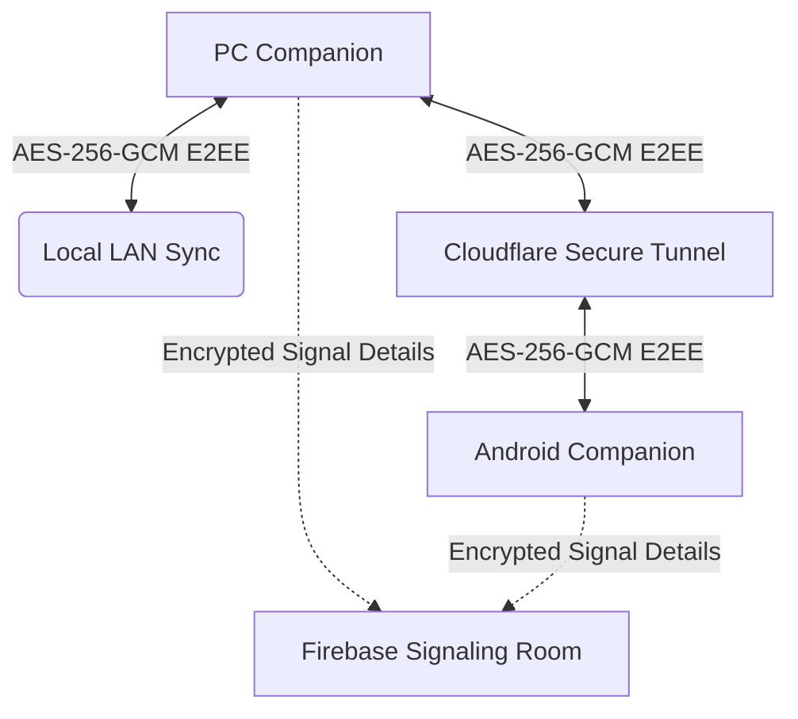

# FlyShelf Privacy Policy

**Last Updated:** May 27, 2026  
**Effective Date:** May 27, 2026  
**Developer:** Shivendra  
**Contact:** shdra06@gmail.com  
**Official Repository:** [github.com/shdra06/FlyShelf](https://github.com/shdra06/FlyShelf)

---

## 1. Executive Summary

FlyShelf ("the App") is a high-performance, cross-device clipboard synchronization utility designed for developers and power users. This document serves as a complete, transparent disclosure of our architecture, data practices, network configurations, and storage models to comply with **Microsoft Store Policy 10.5.1** and global privacy standards.

> [!IMPORTANT]
> **Privacy-by-Design Mandate**:
> - **No Central Servers:** FlyShelf does not own, run, or rent any centralized clipboard servers. All clipboard data remains entirely inside your own private local hardware ecosystem.
> - **Zero Tracking:** We do not collect analytics, track application usage, monitor browser habits, or log telemetry. 
> - **Absolute Encryption:** All sensitive data is encrypted at rest using OS-level protection (Windows DPAPI) and encrypted in transit using industry-standard authenticated encryption (AES-256-GCM).

---

## 2. Information Accessed & Stored Locally

FlyShelf operates primarily as a local application. Below is the technical breakdown of the data stored on your physical machine.

### 2.1 Clipboard Content
FlyShelf monitors the OS-level clipboard daemon (Windows Clipboard / Android Clipboard) to capture copied materials for ease of access and device synchronization.
* **Text & Code Blocks:** Stored locally in a structured JSON database on your computer.
* **Media & Documents:** Images, PDFs, archives, and spreadsheets are cached in local directories.
* **Storage Location (PC):** `%AppData%\FlyShelf\clipboard_history.json` and `%AppData%\FlyShelf\Images\`
* **Storage Location (Android):** Protected application sandbox storage (`AsyncStorage` and local cache).
* **Retention Policy:** Fully customizable by the user. History can be set to automatically purge after 1, 7, 14, or 30 days. The list size is capped at 500 items by default to optimize performance.

### 2.2 Password & Sensitive Data Protection (NEW)
FlyShelf incorporates advanced, local-only heuristics to identify sensitive items such as passwords, multi-factor codes, and credentials copied to the clipboard.
* **Automatic Detection:** High-entropy text values, formats from known password managers, or explicitly marked items are flagged by the system (`IsPassword = true`, `Extension = "PASSWORD"`).
* **At-Rest Cryptography (Windows DPAPI):** Unlike regular clipboard items stored in plaintext JSON, any item classified as a password is encrypted at rest using **Windows Data Protection API (DPAPI)** via `ProtectedData.Protect` inside the `CurrentUser` context, combined with a custom entropy salt.
* **Security Scope:** This cryptographic container is anchored directly to the logged-in Windows User Account. The content can only be decrypted on the exact same physical computer, under the exact same active Windows user account, and cannot be parsed by other users or machines.

### 2.3 App Credentials & Tokens
To support signaling and custom AI features, FlyShelf stores the following metadata locally on your drive:
* **Firebase Anonymous Auth Token:** ephemerally requested and stored encrypted with DPAPI inside `%AppData%\FlyShelf\firebase_auth.dat`.
* **Google Gemini API Key (Optional):** If user-provided for image-to-table AI extraction, the API key is stored encrypted with DPAPI inside `%AppData%\FlyShelf\config.json`.
* **Device Pairing Secrets:** Cryptographically secure keys generated via strong pseudo-random number generators (C# `RandomNumberGenerator` and Expo `crypto.getRandomBytes()`) are stored in `%AppData%\FlyShelf\paired_devices.json`.

---

## 3. Network Architecture & Transit Security

FlyShelf's multi-layered networking stack is built to guarantee that no unencrypted clipboard data is ever exposed to the public internet.

### 3.1 Peer-to-Peer Direct Local Sync (LAN)
When devices reside on the same Local Area Network:
* Sync packages are transferred directly between devices using secure TCP sockets.
* **Transit Encryption:** Every network transaction is encrypted with **AES-256-GCM** utilizing keys derived via a **PBKDF2-SHA256** key derivation function executing **100,000 iterations** against your unique device pairing key. This ensures resistance against local packet sniffing or man-in-the-middle (MITM) attacks.

### 3.2 Ephemeral Remote Routing (Cloudflare Tunnels)
When devices are on different networks, remote synchronization is supported:
* **Ephemeral Tunneling:** FlyShelf spawns an on-demand, secure outbound Cloudflare tunnel utilizing the free `trycloudflare.com` quick-tunnel framework.
* **End-to-End Encryption (E2EE):** Although data traffic transits Cloudflare's global edge network, the actual payload is encrypted at the application level using **AES-256-GCM** before sending. Cloudflare acts solely as an encrypted transport pipe and does not possess the pairing secret keys required to decrypt or inspect your clipboard data.
* **Tunnel Lifespan:** Tunnels are created dynamically upon app startup, change URLs in every session, and terminate instantly when the app is shut down.

### 3.3 Peer Discovery Signaling (Firebase RTDB)
To connect devices without requiring manually managed static IP addresses:
* FlyShelf uses Firebase Realtime Database strictly as a coordinate mapping directory (similar to a dynamic phonebook).
* **Zero Clipboard Storage:** No clipboard items, texts, images, or files are **ever** sent to or stored on Firebase.
* **Metadata Protection:** Paired devices register their local IP addresses and Cloudflare tunnel endpoints in database paths scoped to their cryptographically validated pairing room (`device_groups/{pairingKey}`). These signaling URLs are themselves **AES-256-GCM encrypted** before upload.
* **Session Lifespan:** Signaling coordinates are updated in real-time and automatically deleted immediately upon application closure or peer disconnection.

---

## 4. Third-Party Services Integration

FlyShelf leverages select third-party services to deliver its feature set. No personal information is sold, rented, or tracked.

| Service Provider | Feature / Purpose | Data Transmitted | Security Protocol | Privacy Policy |
| :--- | :--- | :--- | :--- | :--- |
| **Google Firebase** | Anonymous Identity & Peer Discovery | Ephemeral Anonymous UID, encrypted discovery coordinates | HTTPS, REST API, AES-256-GCM | [Firebase Privacy Policy](https://firebase.google.com/support/privacy) |
| **Cloudflare Inc.** | Remote Sync Routing (Tunnels) | Encrypted payload packets in transit | Outbound HTTPS Tunnels, AES-256-GCM E2EE | [Cloudflare Privacy Policy](https://www.cloudflare.com/privacypolicy/) |
| **Google Gemini API** (Optional) | AI Image Table Extraction | User-selected clipboard images (Sent only upon explicit click) | Encrypted HTTPS REST endpoints | [Google AI Terms & Privacy](https://ai.google.dev/terms) |
| **GitHub Releases API** | Checking for updates | Anonymous version inquiry (Public API, no auth headers) | HTTPS | [GitHub Privacy Policy](https://docs.github.com/en/site-policy/privacy-policies/github-general-privacy-statement) |

---

## 5. Security Measures & Sandboxing

To secure your host operating system and prevent local storage congestion, the companion app implements active sandboxing and system grooming:
* **Sandbox Scavenging:** Temporary PDF, image, and zip files created during actions (like PDF merging or zipped archives) are written to a secure temporary path `%TEMP%\FlyShelf_Sandbox\`. The app runs a daily automated groomer that deletes all temporary directories older than 24 hours.
* **Directory Scavenging:** Ephemeral `FlyShelf_*.zip` packages generated during file transfers are actively pruned from the system temp directory every 24 hours, reclaiming local drive space.
* **CORS Protection:** Internal companion HTTP routing endpoints are protected by strict Cross-Origin Resource Sharing (CORS) rules, permitting network connections strictly from authenticated, paired companion devices.
* **Pairing Validation:** Dynamic pairing keys are strictly validated against secure hexagonal patterns (`/^[a-fA-F0-9]{32}$/`) before inclusion in database queries, preventing database path-injection attempts.

---

## 6. Your Rights & Data Control

Because FlyShelf does not keep your data on remote servers, your control over your personal data is absolute:
* **Inspection:** You can directly browse `%AppData%\FlyShelf\` using Windows Explorer to audit or examine every single file generated by the application.
* **Partial Purge:** You can delete individual clipboard entries, unpin items, or use the "Clean Clipboard History" time-range sweeps directly from the app Dashboard.
* **Total Deletion:** You can trigger the "Uninstall FlyShelf" action from the **System Logs** page. This wipes out all application configurations, databases, encrypted credentials, generated PFX certificates, logs, and immediately exits the software.

---

## 7. Contact & Support

For security audits, vulnerability disclosures, or general policy inquiries:
* **Developer:** Shivendra
* **Email:** shdra06@gmail.com
* **Official Repository:** [github.com/shdra06/FlyShelf](https://github.com/shdra06/FlyShelf)
